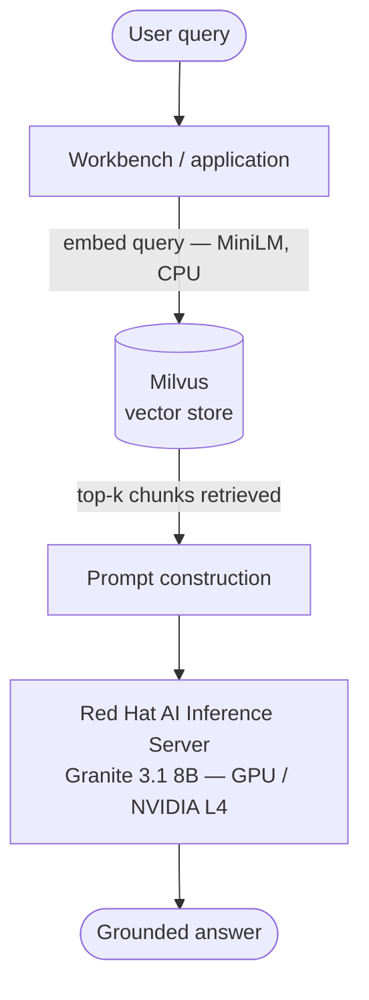
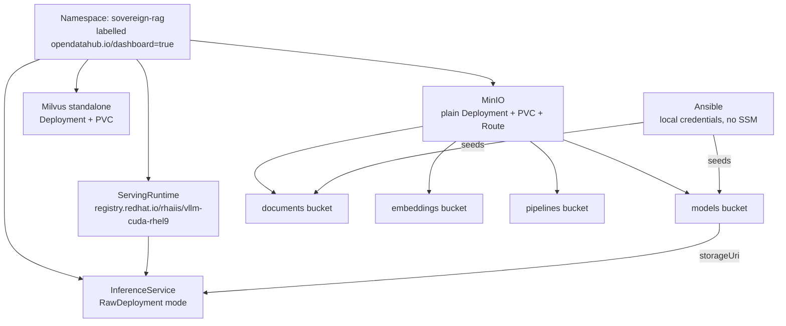

# 01 — Sovereign RAG on RHOAI

## Overview

A fully air-gapped retrieval-augmented generation (RAG) pipeline running on
Red Hat OpenShift AI. A user queries regulatory documents in plain language;
the system retrieves relevant chunks from Milvus and generates a grounded
answer using a locally-served Granite model via Red Hat AI Inference Server
(vLLM).

No data leaves the cluster. No external API calls.

Designed for regulated environments — specifically financial services —
where data sovereignty, auditability, and operational control are
non-negotiable.

**Status: model serving layer confirmed working end to end on a live RHDP
sandbox environment.** Workbench and notebook validation in progress —
see `DEPLOYMENT-LOG-2026-06-30.md` for full detail on what was tested,
what broke, and what was fixed.

---

## Architecture

### Component overview

### Deployment architecture (as actually deployed)

**This differs from the original design** — no Terraform, no GitOps, no
MinIO Operator. See "Deployment notes" below for why.

---

## Repository structure

    01-sovereign-rag/
    ├── README.md                         ← this file
    ├── DEPLOYMENT-LOG-2026-06-30.md       ← detailed log of first live deploy
    ├── manifests/                        ← RHOAI platform manifests
    │   ├── 00-namespace.yaml
    │   ├── 02-milvus.yaml
    │   ├── 03-model-serving-runtime.yaml
    │   ├── 04-inference-service.yaml
    │   ├── 05-workbench.yaml
    │   ├── 06-data-connection.yaml
    │   └── 07-serviceaccount.yaml
    ├── gitops/                           ← NOT USED in this deployment path — see notes
    ├── minio/
    │   └── tenant/
    │       ├── tenant.yaml               ← plain MinIO Deployment, not an operator CR
    │       └── tenant-secret.yaml
    ├── terraform/                        ← NOT USED in this deployment path — see notes
    ├── ansible/
    │   ├── inventory.yaml
    │   ├── configure-minio.yaml
    │   └── roles/
    │       └── minio-setup/
    │           └── tasks/
    │               ├── bucket-policies.yaml
    │               ├── seed-models.yaml
    │               └── seed-documents.yaml
    ├── notebooks/
    │   ├── 01-ingest-and-embed.ipynb
    │   ├── 02-rag-query.ipynb
    │   ├── requirements.txt
    │   └── WORKBENCH-SETUP.md
    └── data/
        └── README.md

Note: `manifests/01-datascienceproject.yaml` was removed — RHOAI has no
`DataScienceProject` CRD. A namespace is labelled instead (see Deploy steps).

---

## Deployment notes — read before deploying

This use case was originally designed assuming a ROSA cluster with full
AWS IAM access (Terraform-managed credentials, GitOps-managed MinIO via
its upstream Operator). The first live deployment was on an **RHDP
sandbox** environment, which has different constraints:

- **No AWS credentials available** — RHDP provides OpenShift access only.
  Terraform and AWS SSM are not used. Skip the `terraform/` directory
  entirely for RHDP-style environments.
- **The certified OLM catalog only offers MinIO AIStor**, not the
  open-source MinIO Operator. AIStor uses a different CRD and operational
  model. Rather than adopt it, MinIO is deployed as a **plain Kubernetes
  Deployment** (`minio/tenant/tenant.yaml` — name kept for continuity,
  content is a standard Deployment/Service/PVC/Route, not an operator CR).
- **GitOps (Argo CD) was not used** for the same reason — once the
  operator path was abandoned, there was nothing left for GitOps to
  manage that a direct `oc apply` doesn't handle equally well. The
  `gitops/` directory is kept for environments where the upstream MinIO
  Operator _is_ available and Argo CD is preferred, but is not part of
  the validated deploy path below.

If you're deploying on a full ROSA environment with AWS IAM access and
the open-source MinIO Operator available, the original Terraform/GitOps
path may still be viable — but it has not been tested end-to-end. The
steps below are the **confirmed-working path**.

---

## Infrastructure

### GPU

NVIDIA L4 Tensor Core (24GB VRAM), AWS `g6.xlarge`. Confirmed node label:

    nvidia.com/gpu.product=NVIDIA-L4

Verify on your cluster before deploying:

    oc get nodes -o json | jq -r '.items[].metadata.labels["nvidia.com/gpu.product"]' | grep -v null

Update the `nodeSelector` in `manifests/04-inference-service.yaml` if your
cluster reports a different value.

### Model serving image

**`registry.redhat.io/rhaiis/vllm-cuda-rhel9:3.2.5`** — Red Hat AI
Inference Server. This requires `registry.redhat.io` to be reachable and
authenticated, which is normally already configured via the cluster's
global pull secret (RHOAI itself pulls from this registry). Verify:

    oc get secret/pull-secret -n openshift-config \
      -o jsonpath='{.data.\.dockerconfigjson}' | base64 -d \
      | grep -o '"registry.redhat.io"'

The original design used a community `quay.io/rh-aiservices-bu` image;
that tag no longer exists. RHAIIS is also the better choice for a
regulated-industry demo narrative — it's a named, supported Red Hat
product rather than a community image.

### Object storage — MinIO

Self-hosted, deployed as a plain Deployment (see Deployment notes above).
Reachable via an OpenShift Route for both the S3 API and the web console.
Four buckets: `models`, `documents`, `embeddings`, `pipelines`.

### Vector store — Milvus

Milvus standalone (single pod), 10Gi PVC. Unchanged from original design,
confirmed working as-is.

---

## Prerequisites

- `oc` CLI authenticated to the target cluster
- `mc` — MinIO client. **On macOS, verify this is genuinely the MinIO
  client and not Midnight Commander** — both install a binary named `mc`
  via Homebrew. Confirm with `mc --version`; it should report a MinIO
  `RELEASE.*` version string, not `GNU Midnight Commander`.
- `hf` CLI (not `huggingface-cli` — deprecated and non-functional):

      pip install -U huggingface_hub[cli]

- A HuggingFace token with access to `ibm-granite/granite-3.1-8b-instruct`
- Two or more regulatory PDFs downloaded to `data/raw/` — see
  `data/README.md`. **Verify downloads are genuine PDFs before seeding**:
  some regulator sites (e.g. RBNZ) return bot-detection HTML challenge
  pages to `curl` requests, which silently save as `.pdf`-named HTML
  files. Always check with `file *.pdf` before uploading.
- `ansible` (no AWS collection needed for the RHDP path)

---

## Deploy (confirmed-working path, RHDP-style environment)

### Step 1 — Namespace and RHOAI dashboard visibility

    oc apply -f manifests/00-namespace.yaml
    oc label namespace sovereign-rag opendatahub.io/dashboard=true

### Step 2 — Deploy MinIO

    oc apply -f minio/tenant/tenant-secret.yaml   # set MINIO_ACCESS_KEY / MINIO_SECRET_KEY via envsubst — see file header
    oc apply -f minio/tenant/tenant.yaml
    oc expose svc minio --port=9000 --name=minio-api -n sovereign-rag
    oc patch route minio-api -n sovereign-rag --type merge -p '{"spec":{"tls":{"termination":"edge"}}}'

Confirm it's running:

    oc get pods -n sovereign-rag -l app=minio

### Step 3 — Create buckets

    MINIO_API_ROUTE=$(oc get route minio-api -n sovereign-rag -o jsonpath='{.spec.host}')
    mc alias set sovereign-rag https://$MINIO_API_ROUTE minio-admin <your-secret-key>
    mc mb sovereign-rag/models
    mc mb sovereign-rag/documents
    mc mb sovereign-rag/embeddings
    mc mb sovereign-rag/pipelines

### Step 4 — Data connection secret and ServiceAccount

    MINIO_ACCESS_KEY=minio-admin \
    MINIO_SECRET_KEY=<your-secret-key> \
    MINIO_API_ROUTE=$MINIO_API_ROUTE \
      envsubst < manifests/06-data-connection.yaml | oc apply -f -

    oc apply -f manifests/07-serviceaccount.yaml

### Step 5 — Seed MinIO (model + documents)

    cd ansible/
    MINIO_ACCESS_KEY=minio-admin \
    MINIO_SECRET_KEY=<your-secret-key> \
    MINIO_ENDPOINT="https://$MINIO_API_ROUTE" \
    HF_TOKEN=<your-hf-token> \
      ansible-playbook -i inventory.yaml configure-minio.yaml

This downloads ~15GiB of model weights — allow several minutes. Verify:

    mc du sovereign-rag/models/granite-3.1-8b-instruct
    mc ls sovereign-rag/documents

### Step 6 — Deploy Milvus

    cd ../manifests/
    oc apply -f 02-milvus.yaml
    oc get pods -n sovereign-rag -l app=milvus -w

### Step 7 — Deploy the ServingRuntime and InferenceService

    oc apply -f 03-model-serving-runtime.yaml
    oc apply -f 04-inference-service.yaml
    oc get inferenceservice granite-instruct -n sovereign-rag -w

Wait for `READY: True`. The model load itself (init container pulling
~15GiB from MinIO, then vLLM loading into GPU memory) takes roughly
3-5 minutes total.

### Step 8 — Smoke test

    POD=$(oc get pods -n sovereign-rag -l serving.kserve.io/inferenceservice=granite-instruct -o jsonpath='{.items[0].metadata.name}')
    oc port-forward -n sovereign-rag $POD 8081:8080

In a separate terminal:

    curl -s http://localhost:8081/v1/chat/completions \
      -H "Content-Type: application/json" \
      -d '{"model": "/mnt/models", "messages": [{"role": "user", "content": "What is capital adequacy in banking, in one sentence?"}], "max_tokens": 100}' \
      | python3 -m json.tool

A coherent, on-topic answer confirms the model serving layer is fully
working before you move on to the workbench.

### Step 9 — Deploy the Workbench and run notebooks

    oc apply -f manifests/05-workbench.yaml

Follow `notebooks/WORKBENCH-SETUP.md` for environment variable
configuration, then run `01-ingest-and-embed.ipynb` followed by
`02-rag-query.ipynb`.

**Note:** `WORKBENCH-SETUP.md` is still being updated to reflect
RawDeployment mode (internal service URL, no bearer token required,
rather than the original Serverless/Knative assumptions). Check
`DEPLOYMENT-LOG-2026-06-30.md` for the confirmed working endpoint values
in the meantime.

---

## Teardown

    oc delete namespace sovereign-rag

All resources are namespace-scoped. One command cleans everything created
in this deploy path. (Terraform/GitOps teardown steps don't apply since
those layers weren't used.)

---

## Known issues / things to verify on a new environment

- [ ] GPU node label — confirm `NVIDIA-L4` matches your cluster
- [ ] `registry.redhat.io` reachable and authenticated via the cluster pull secret
- [ ] MinIO Operator catalog contents — if the open-source Operator
      _is_ available on your cluster (not AIStor), the original
      GitOps/Tenant-CR path may be preferable; not validated here
- [ ] AWS credentials — if available (full ROSA, not RHDP), the
      Terraform/SSM path can be used instead of local environment
      variables; not validated here
- [ ] `oc port-forward svc/granite-instruct-predictor 8081:80` failed
      with a connection error despite correct Service config
      (`targetPort: 8080`) — forwarding directly to the pod worked as
      a workaround. Worth re-testing the Service-based forward; may be
      an RHDP networking quirk rather than a manifest issue.

---

## Demo narrative

_To be developed once notebooks are validated end-to-end._
