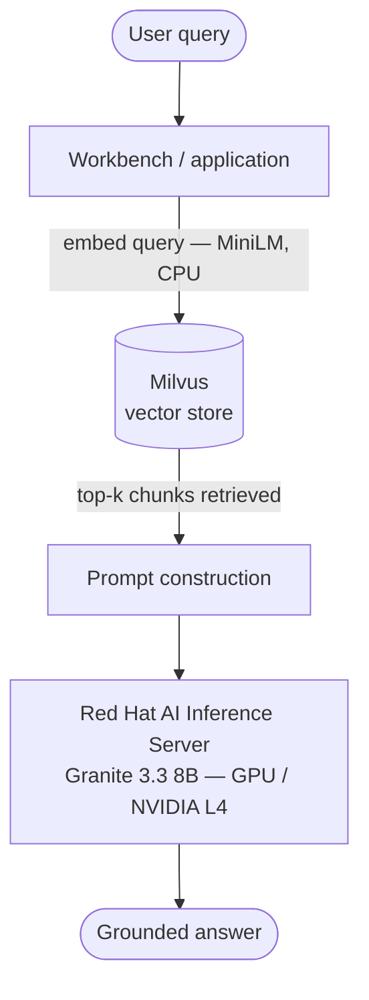
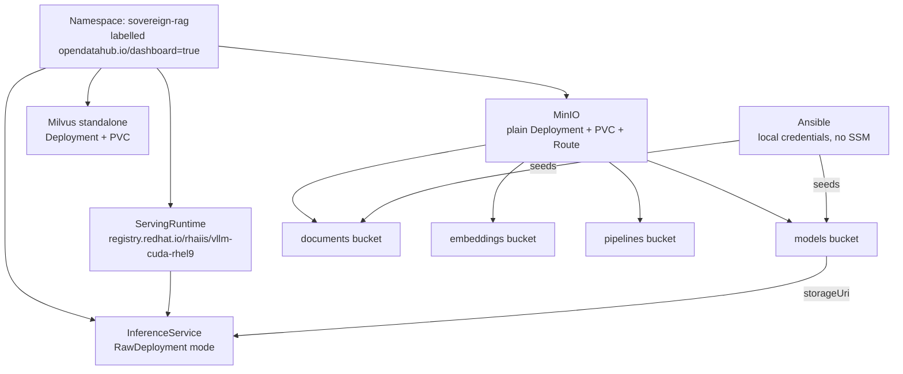

# 01 — Sovereign RAG on RHOAI

## Overview

A fully air-gapped retrieval-augmented generation (RAG) pipeline running on
Red Hat OpenShift AI. A user queries regulatory documents in plain language;
the system retrieves relevant chunks from Milvus and generates a grounded
answer using a locally-served Granite model via Red Hat AI Inference Server
(vLLM).

No data leaves the cluster. No external API calls.

Designed for regulated environments — specifically financial services —
where data sovereignty, auditability, and operational control are
non-negotiable.

**Status:** Model serving layer confirmed working end to end on RHOAI 2.25.8
(RHDP sandbox, 2026-06-30). Updated for RHOAI 3.4 — awaiting first live
validation. See `DEPLOYMENT-LOG-2026-06-30.md` for the full record of what
was tested, what broke, and what was fixed on 2.25.8. All confirmed fixes
are incorporated into the current manifests.

---

## Architecture

### Component overview

```mermaid
flowchart TD
    A([User query]) --> B[Workbench / application]
    B -->|embed query — MiniLM, CPU| C[(Milvus\nvector store)]
    C -->|top-k chunks retrieved| D[Prompt construction]
    D --> E[Red Hat AI Inference Server\nGranite 3.3 8B — GPU / NVIDIA L4]
    E --> F([Grounded answer])
```

### Deployment architecture (as actually deployed)

```mermaid
flowchart TD
    NS[Namespace: sovereign-rag\nlabelled opendatahub.io/dashboard=true] --> MINIO[MinIO\nplain Deployment + PVC + Route]
    NS --> MILVUS[Milvus standalone\nDeployment + PVC]
    NS --> SR[ServingRuntime\nregistry.redhat.io/rhaiis/vllm-cuda-rhel9]
    NS --> ISVC[InferenceService\nRawDeployment mode]
    SR --> ISVC
    MINIO --> B1[models bucket]
    MINIO --> B2[documents bucket]
    MINIO --> B3[embeddings bucket]
    MINIO --> B4[pipelines bucket]
    B1 -->|storageUri| ISVC
    ANSIBLE[Ansible\nlocal credentials, no SSM] -->|seeds| B1
    ANSIBLE -->|seeds| B2
```

This differs from the original design — no Terraform, no GitOps, no MinIO
Operator. See "Deployment notes" below for why.

---

## Repository structure

    01-sovereign-rag/
    ├── README.md                         ← this file
    ├── DEPLOYMENT-LOG-2026-06-30.md      ← detailed log of first live deploy on RHOAI 2.25.8
    ├── manifests/                        ← RHOAI platform manifests
    │   ├── 00-namespace.yaml
    │   ├── 02-milvus.yaml
    │   ├── 03-model-serving-runtime.yaml
    │   ├── 04-inference-service.yaml
    │   ├── 05-workbench.yaml             ← env vars baked in; create workbench-credentials Secret first
    │   ├── 06-data-connection.yaml
    │   └── 07-serviceaccount.yaml
    ├── gitops/                           ← NOT USED in the validated deploy path — see notes
    ├── minio/
    │   └── tenant/
    │       ├── tenant.yaml               ← plain MinIO Deployment, not an operator CR
    │       └── tenant-secret.yaml
    ├── terraform/                        ← NOT USED in the validated deploy path — see notes
    ├── ansible/
    │   ├── inventory.yaml
    │   ├── configure-minio.yaml
    │   └── roles/
    │       └── minio-setup/
    │           └── tasks/
    │               ├── bucket-policies.yaml
    │               ├── seed-models.yaml
    │               └── seed-documents.yaml
    ├── notebooks/
    │   ├── 01-ingest-and-embed.ipynb
    │   ├── 02-rag-query.ipynb
    │   ├── requirements.txt
    │   └── WORKBENCH-SETUP.md
    └── data/
        └── README.md

---

## Deployment notes — read before deploying

This use case was originally designed assuming a ROSA cluster with full
AWS IAM access (Terraform-managed credentials, GitOps-managed MinIO via
its upstream Operator). The first live deployment was on an RHDP sandbox
environment, which has different constraints. The validated deploy path
below reflects what actually works:

- **No AWS credentials available** — RHDP provides OpenShift access only.
  Terraform and AWS SSM are not used. Skip the `terraform/` directory
  entirely for RHDP-style environments.
- **The certified OLM catalog only offers MinIO AIStor**, not the
  open-source MinIO Operator our manifests were written for. AIStor uses
  a different CRD (`ObjectStore`, not `Tenant`) and a different operational
  model. MinIO is deployed instead as a plain Kubernetes Deployment
  (`minio/tenant/tenant.yaml` — the filename is kept for continuity; the
  content is a standard Deployment/Service/PVC/Route, not an operator CR).
- **GitOps (Argo CD) was not used** — once the operator path was abandoned,
  direct `oc apply` handles everything equally well. The `gitops/` directory
  is kept for environments where the upstream MinIO Operator is available
  and Argo CD is preferred, but is not part of the validated path.

If deploying on a full ROSA environment with AWS IAM access and the
open-source MinIO Operator available, the Terraform/GitOps path may be
viable — but it has not been tested end-to-end. The steps below are the
confirmed-working path.

---

## Infrastructure

### GPU

NVIDIA L4 Tensor Core (24GB VRAM), AWS `g6.xlarge`. Confirmed node label:

    nvidia.com/gpu.product=NVIDIA-L4

Verify on your cluster before deploying:

    oc get nodes -o json \
      | jq -r '.items[].metadata.labels["nvidia.com/gpu.product"]' \
      | grep -v null

Update the `nodeSelector` in `manifests/04-inference-service.yaml` if your
cluster reports a different value.

### Model

**Granite 3.3 8B Instruct** (`ibm-granite/granite-3.3-8b-instruct`).
Updated from 3.1 for consistency with UC02 and to use the current
Red Hat-supported Granite model. Fits comfortably within the L4's 24GB
VRAM at bfloat16 with `--gpu-memory-utilization=0.85`.

The model is served under the name `granite-3-3-8b-instruct` (set via
`--served-model-name` in the ServingRuntime). Use this name in API calls
and notebook configuration.

### Model serving image

**`registry.redhat.io/rhaiis/vllm-cuda-rhel9:3.2.5`** — Red Hat AI
Inference Server. A named, supported Red Hat product — the better choice
for a regulated-industry demo over a community Quay image. The original
community Quay tag (`quay.io/rh-aiservices-bu/vllm-openai-ubi9:0.6.2`)
no longer exists.

Verify `registry.redhat.io` is authenticated via the cluster pull secret:

    oc get secret/pull-secret -n openshift-config \
      -o jsonpath='{.data.\.dockerconfigjson}' | base64 -d \
      | grep -o '"registry.redhat.io"'

Validate the image tag is still current on first deploy:

    oc get is -n redhat-ods-applications | grep vllm

### Object storage — MinIO

Self-hosted, deployed as a plain Deployment with `strategy: Recreate`.
The `Recreate` strategy is required for correctness on an RWO PVC —
`RollingUpdate` (the default) corrupts MinIO's single-drive erasure
initialisation on RHOAI 3.4. Reachable via Route for the S3 API and
console. Four buckets: `models`, `documents`, `embeddings`, `pipelines`.

### Vector store — Milvus

Milvus standalone (single pod), 10Gi PVC. No changes from the original
design. Confirmed working on both RHOAI 2.25.8 and expected to work
unchanged on 3.4.

### KServe behaviour on RHOAI 3.4

On RHOAI 3.4, KServe RawDeployment creates a headless predictor service
(ClusterIP: None). In-cluster clients must target the container port
(`:8080`) directly — there is no service port translation layer. The
`INFERENCE_ENDPOINT` environment variable in the workbench reflects this:

    http://granite-instruct-predictor.sovereign-rag.svc.cluster.local:8080

This differs from the 2.25.8 behaviour where the service port was 80
forwarding to container port 8080.

---

## Prerequisites

- `oc` CLI authenticated to the target cluster
- `mc` (MinIO client) — on macOS, verify this is the MinIO client and not
  Midnight Commander. Both install a binary named `mc`. Confirm with:

      mc --version

  Expected output: a MinIO `RELEASE.*` version string.

- `hf` CLI — the `huggingface-cli` binary is deprecated and non-functional
  (it silently no-ops, producing an empty download with no error). Install
  the replacement:

      pip install -U "huggingface_hub[cli]"

- A HuggingFace token with access to `ibm-granite/granite-3.3-8b-instruct`
- Two or more regulatory PDFs downloaded to `data/raw/` — see `data/README.md`

  **Verify downloads are genuine PDFs before seeding.** Regulatory websites
  such as RBNZ use bot detection that returns an HTML challenge page when
  `curl` requests are blocked — these save silently as `.pdf`-named HTML
  files. Always check with `file *.pdf` before running Ansible.

- `ansible` with no special collections required for the RHDP path

---

## Deploy (confirmed-working path, RHDP-style environment)

### Step 1 — Namespace and RHOAI dashboard visibility

    oc apply -f manifests/00-namespace.yaml
    oc label namespace sovereign-rag opendatahub.io/dashboard=true

### Step 2 — Deploy MinIO

Apply the credentials secret first (substituting your chosen values):

    MINIO_ACCESS_KEY=<your-access-key> \
    MINIO_SECRET_KEY=<your-secret-key> \
      envsubst < minio/tenant/tenant-secret.yaml | oc apply -f -

Then deploy MinIO and expose its API Route:

    oc apply -f minio/tenant/tenant.yaml

    oc expose svc minio --port=9000 --name=minio-api -n sovereign-rag
    oc patch route minio-api -n sovereign-rag \
      --type merge -p '{"spec":{"tls":{"termination":"edge"}}}'

Confirm running:

    oc get pods -n sovereign-rag -l app=minio

### Step 3 — Create buckets

    MINIO_API_ROUTE=$(oc get route minio-api -n sovereign-rag \
      -o jsonpath='{.spec.host}')

    mc alias set sovereign-rag https://$MINIO_API_ROUTE \
      <your-access-key> <your-secret-key>

    mc mb sovereign-rag/models
    mc mb sovereign-rag/documents
    mc mb sovereign-rag/embeddings
    mc mb sovereign-rag/pipelines

### Step 4 — Data connection secret and ServiceAccount

    MINIO_ACCESS_KEY=<your-access-key> \
    MINIO_SECRET_KEY=<your-secret-key> \
    MINIO_API_ROUTE=$MINIO_API_ROUTE \
      envsubst < manifests/06-data-connection.yaml | oc apply -f -

    oc apply -f manifests/07-serviceaccount.yaml

### Step 5 — Seed MinIO

    cd ansible/

    MINIO_ACCESS_KEY=<your-access-key> \
    MINIO_SECRET_KEY=<your-secret-key> \
    MINIO_ENDPOINT="https://$MINIO_API_ROUTE" \
    HF_TOKEN=<your-hf-token> \
      ansible-playbook -i inventory.yaml configure-minio.yaml

    cd ..

This downloads ~15GiB of Granite 3.3 8B model weights — allow 10–20
minutes depending on connection speed. Verify completion before proceeding:

    mc du sovereign-rag/models/granite-3.3-8b-instruct
    mc ls sovereign-rag/documents

The model bucket should show ~15GiB across four `.safetensors` shards plus
config and tokenizer files. If `mc du` returns zero or the bucket is empty,
the download silently failed — check `hf` is installed correctly and your
HF_TOKEN is valid.

### Step 6 — Deploy Milvus

    oc apply -f manifests/02-milvus.yaml
    oc get pods -n sovereign-rag -l app=milvus -w

Wait for `1/1 Running`. The PVC will show `Pending` briefly — this is
expected with `WaitForFirstConsumer` storage classes (EBS on AWS).

### Step 7 — Deploy the ServingRuntime and InferenceService

    oc apply -f manifests/03-model-serving-runtime.yaml
    oc apply -f manifests/04-inference-service.yaml
    oc get inferenceservice granite-instruct -n sovereign-rag -w

Wait for `READY: True`. The init container pulls ~15GiB from MinIO
(2–3 minutes), then vLLM loads the weights into GPU memory (1–2 minutes).
Total: roughly 3–5 minutes from pod start to ready.

### Step 8 — Smoke test

Confirm the model is serving before proceeding to the workbench:

    POD=$(oc get pods -n sovereign-rag \
      -l serving.kserve.io/inferenceservice=granite-instruct \
      -o jsonpath='{.items[0].metadata.name}')

    oc port-forward -n sovereign-rag $POD 8081:8080

In a separate terminal:

    # Confirm model is listed
    curl -s http://localhost:8081/v1/models | python3 -m json.tool

    # Confirm generation works
    curl -s http://localhost:8081/v1/chat/completions \
      -H "Content-Type: application/json" \
      -d '{"model": "granite-3-3-8b-instruct", "messages": [{"role": "user", "content": "What is capital adequacy in banking, in one sentence?"}], "max_tokens": 100}' \
      | python3 -m json.tool

A coherent, on-topic answer confirms the model serving layer is working
before you add Milvus and embeddings into the picture.

### Step 9 — Deploy the workbench

Create the credentials secret the workbench manifest references:

    oc create secret generic workbench-credentials \
      -n sovereign-rag \
      --from-literal=MINIO_ACCESS_KEY=<your-access-key> \
      --from-literal=MINIO_SECRET_KEY=<your-secret-key>

Confirm the workbench image tag before applying — the tag in the manifest
(`2025.2`) may resolve differently across RHOAI versions. Get the correct
SHA-pinned reference from the cluster's own imagestream:

    oc get imagestream jupyter-datascience-cpu-py312-ubi9 \
      -n redhat-ods-applications \
      -o jsonpath='{.status.tags[?(@.tag=="2025.2")].items[0].dockerImageReference}'

Update the `image:` field in `manifests/05-workbench.yaml` if needed,
then apply:

    oc apply -f manifests/05-workbench.yaml
    oc get pods -n sovereign-rag | grep workbench

Wait for `2/2 Running`, then follow `notebooks/WORKBENCH-SETUP.md` to
run the notebooks.

---

## Teardown

All resources are namespace-scoped:

    oc delete namespace sovereign-rag

One command removes everything deployed in this path. Terraform and GitOps
teardown steps do not apply.

---

## Known issues and validation checklist

Run these checks on a new environment before starting the deploy sequence:

- [ ] GPU node label — confirm `NVIDIA-L4` matches your cluster:

      oc get nodes -o json | jq -r '.items[].metadata.labels["nvidia.com/gpu.product"]' | grep -v null

- [ ] `registry.redhat.io` authenticated via cluster pull secret
- [ ] RHAIIS image tag (`3.2.5`) still current — validate against the
      cluster's available images on first deploy
- [ ] Workbench image tag (`2025.2`) resolves on this RHOAI version —
      check the imagestream per Step 9 above
- [ ] No competing workload holding the GPU — RHDP catalog items sometimes
      ship a sample model (`my-first-model`) that claims the GPU on startup.
      Delete it if present before deploying the InferenceService
- [ ] `mc ls` on an empty prefix returns `rc=0` (not an error) — the
      Ansible idempotency check uses `stdout` content, not exit code,
      specifically because of this behaviour. Do not change this check.
- [ ] `oc port-forward svc/granite-instruct-predictor 8081:80` may fail
      despite the Service having `targetPort: 8080` — forwarding directly
      to the pod works as a reliable alternative

---

## Demo narrative

_To be developed once the end-to-end notebook run is validated on RHOAI 3.4._
