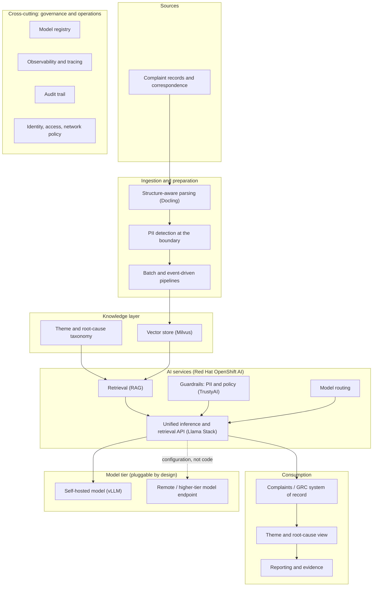
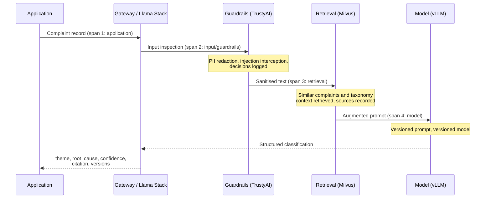

# Architecture

## Intent

This document describes the architecture at two levels: the conceptual architecture
(stable, organisation-agnostic, reusable in engagement material) and the demo
architecture (the concrete build in an RHDP-provisioned environment). The separation
is deliberate. The conceptual architecture is what an enterprise architecture
audience should assess; the demo architecture is one honest instantiation of it,
with its simplifications stated rather than hidden.

## Conceptual architecture

The design is layered. Each layer has a single responsibility, the interfaces between
layers are stable, and components within a layer can change without disturbing the
others. In a space moving as quickly as AI, that substitutability is the property
with the longest useful life.



Notes on the layers:

- **Sources.** Complaint records and supporting correspondence, in whatever mixed
  formats the organisation holds them. The demo substitutes synthetic records with
  documented fixture conventions.
- **Ingestion and preparation.** Docling performs structure-aware parsing into
  clean text. PII detection is applied at this boundary, before anything is
  embedded, stored or sent to a model. The pipeline supports both batch backfill
  and event-driven processing of new records.
- **Knowledge layer.** Complaint embeddings in Milvus, alongside the versioned
  theme and root-cause taxonomy. The taxonomy is data, not code: it is released
  and versioned like any other governed artefact.
- **AI services.** Llama Stack provides the single API the application consumes.
  Retrieval, guardrails and model routing compose behind it. The application never
  addresses a model directly.
- **Model tier.** Deliberately pluggable. The demo runs a self-hosted open model
  in-cluster; a remote or higher-tier endpoint attaches by configuration change
  only. This converts model selection from an architectural commitment into an
  operational decision.
- **Consumption.** Structured classification results are written back to the
  organisation's complaints or GRC system of record, feeding a theme-level view
  and audit-ready reporting. The demo substitutes a thin UI and a demo store.
- **Cross-cutting.** Registry, observability, audit and identity are platform
  concerns inherited from the OpenShift estate, not features bolted onto the
  application.

## Classification data flow

Every classification follows the same path and emits the same evidence. The span
structure is a documented design commitment of this use case, shaped so its
evidence reads naturally alongside control-plane style demonstrations.



The output schema is fixed and has no bypass path:

```json
{
  "theme": "...",
  "root_cause": "...",
  "confidence": 0.0,
  "citation": "source complaint span reference",
  "prompt_version": "...",
  "model_version": "...",
  "taxonomy_version": "..."
}
```

Classifications below the confidence threshold are routed to a human review queue
rather than written back as accepted results. The threshold is configuration, and
the routing decision is itself logged evidence.

## Trust boundaries

Three boundaries matter, and the demo makes each one observable:

1. **The data boundary.** In the demo configuration, ingestion, embedding,
   retrieval, inference and evidence all run inside the cluster. There is no
   external inference dependency. The deployment manifests are the proof: no
   external model endpoint appears in configuration.
2. **The input boundary.** Complaint text is untrusted user content. It is
   inspected (PII, injection) before it reaches the vector store or a model, and
   the inspection decision is logged per record.
3. **The change boundary.** Prompts, taxonomy and model configuration change only
   through tracked releases. Nothing is edited in place; every output is
   attributable to the release that produced it.

## Demo architecture: deviations from the conceptual model

Honest simplifications in the demo build, stated so they are not mistaken for the
recommended production shape:

| Area              | Conceptual model                                                       | Demo build                                                                          | Rationale                                                                                    |
| ----------------- | ---------------------------------------------------------------------- | ----------------------------------------------------------------------------------- | -------------------------------------------------------------------------------------------- |
| Model tier        | Self-hosted and/or remote frontier model per workload economics        | Single self-hosted 8B-class model; second local backend used to demonstrate routing | Removes external dependencies; keeps the demo deterministic and rebuildable anywhere         |
| System of record  | Organisation's complaints/GRC platform via defined write-back contract | Demo store plus thin UI                                                             | Integration is engagement-specific; the write-back contract is documented, not simulated     |
| Ingestion trigger | Event-driven from source systems                                       | S3 bucket watch with batch backfill                                                 | Same pipeline shape, simpler trigger                                                         |
| Scale             | Distributed ingestion (Ray) where volume warrants                      | Single-node pipeline                                                                | Demo data volumes do not justify distribution; the scaling path is documented                |
| Review queue      | Workflow integration with case management                              | Simple queue view in the demo UI                                                    | The routing decision and its evidence are the demonstrated control, not the workflow tooling |

## Open decisions

Recorded here until resolved; each will close with an ADR.

1. **RHOAI version and capability baseline on RHDP.** The tracing/evaluation and
   gateway capabilities used here depend on the RHOAI version the chosen RHDP
   catalog item provisions. Day-one validation task, and the largest potential
   source of drift from this document. Prior lab work validated against RHOAI
   2.25.x; this design assumes newer platform capabilities that must be confirmed.
2. **Tracing and evaluation conventions.** The four-stage span convention is
   defined and owned within this use case. Span naming, MLflow experiment
   structure and evaluation record locations will be settled during platform
   validation and recorded in an ADR. The convention is deliberately shaped so
   that evidence reads naturally alongside a control-plane style demonstration,
   keeping later convergence with parallel work low-cost, but no external
   alignment is a prerequisite. Pipeline code is held only on platform
   validation, not on any external conversation.
3. **Gateway layer composition.** Whether application registration, quotas and
   credential revocation are demonstrated through the platform's
   models-as-a-service capability or a composed gateway is decided by what the
   provisioned environment actually offers, validated on day one and recorded
   in an ADR. Prefer platform-native capability over composition wherever the
   provisioned version supports it.
4. **Milvus integration path.** Llama Stack's Milvus integration (inline vs
   remote) to be validated in the target environment, including whether the
   dependency conflict recorded in Use Case 01 (pymilvus/marshmallow) is
   sidestepped by consuming Milvus through Llama Stack rather than directly.
5. **Guardrail policy definitions.** Authored within this use case as
   self-contained, versioned definitions, kept deliberately portable: defined at
   platform level, separate from the application, and consumable by any workload
   on the cluster. If convergence with parallel control-plane work happens later,
   portable definitions make that a merge, not a rewrite.
