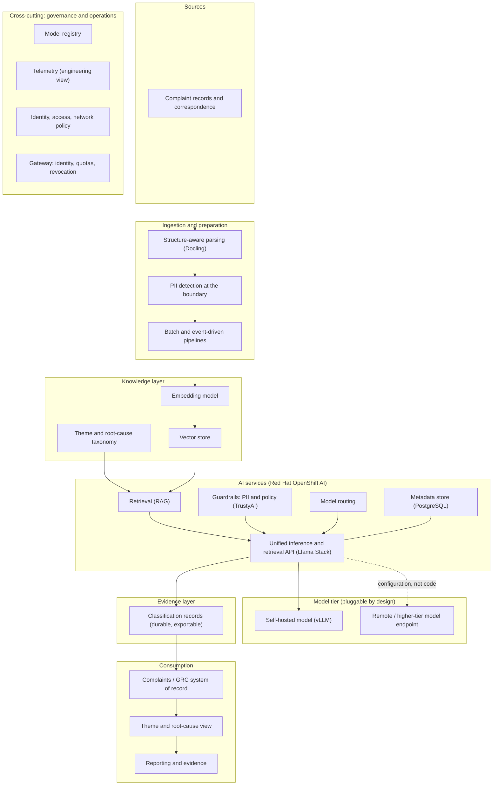
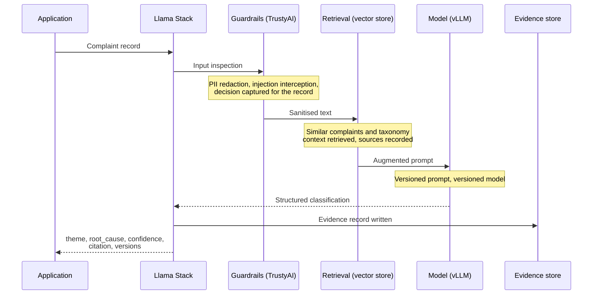

# Architecture

## Intent

This document describes the architecture at two levels: the conceptual
architecture (stable, organisation-agnostic, reusable in engagement material)
and the demo architecture (the concrete build, validated against a live
environment). The separation is deliberate. The conceptual architecture is what
an enterprise architecture audience should assess; the demo architecture is one
honest instantiation of it, with its simplifications and platform constraints
stated rather than hidden.

Validated against RHOAI 3.4.2 on OpenShift 4.20.28 (2026-07-15). Previously
validated against RHOAI 2.25.8; the differences between the two are recorded in
the deployment logs and summarised under [Validated baseline](#validated-baseline).

## Conceptual architecture

The design is layered. Each layer has a single responsibility, the interfaces
between layers are stable, and components within a layer can change without
disturbing the others. In a space moving as quickly as AI, that
substitutability is the property with the longest useful life. Two major RHOAI
versions in two days changed the metadata store, the vector store defaults, the
embedding defaults and the API surface. The layering is what kept the design
intact through all of it.



Notes on the layers:

- **Sources.** Complaint records and supporting correspondence, in whatever
  mixed formats the organisation holds them. The demo substitutes synthetic
  records with documented fixture conventions.
- **Ingestion and preparation.** Docling performs structure-aware parsing into
  clean text. PII detection is applied at this boundary, before anything is
  embedded, stored or sent to a model. The pipeline supports both batch
  backfill and event-driven processing of new records.
- **Knowledge layer.** Complaint embeddings in a vector store, alongside the
  versioned theme and root-cause taxonomy. The taxonomy is data, not code: it
  is released and versioned like any other governed artefact. Both the vector
  store and the embedding model are explicit choices on RHOAI 3.x rather than
  platform defaults; see [Validated baseline](#validated-baseline).
- **AI services.** Llama Stack provides the single API the application
  consumes. Retrieval, guardrails and model routing compose behind it. The
  application never addresses a model directly. From RHOAI 3.2 a PostgreSQL
  metadata store is a required component of this layer.
- **Model tier.** Deliberately pluggable. The application talks to a stable
  API rather than to a model provider, so model selection is a configuration
  decision rather than an architectural commitment.
- **Evidence layer.** Every classification produces a durable, structured
  record: the audit trail the controls matrix depends on. Distinct from
  telemetry, which serves engineers rather than compliance. See ADR-0004.
- **Consumption.** Structured classification results are written back to the
  organisation's complaints or GRC system of record, feeding a theme-level view
  and audit-ready reporting. The demo substitutes a thin application and a demo
  store; see docs/demo-experience.md and ADR-0007.
- **Cross-cutting.** Registry, telemetry, identity and gateway are platform
  concerns inherited from the OpenShift estate, not features bolted onto the
  application.

## Classification processing flow

Every classification follows the same path and emits the same evidence record.
These are **processing stages**, not a tracing convention: ADR-0004 retired the
four-stage span structure in favour of a deliberately written evidence record.
The stages remain a useful description of what happens, and the evidence record
carries a field for each decision made along the way.



The evidence record is fixed and has no bypass path. Its schema is defined in
ADR-0004 and constrained further by the five demo views in
docs/demo-experience.md:

```json
{
  "complaint_id": "...",
  "timestamp": "...",
  "theme_id": "THM-05",
  "root_cause_id": "RC-02",
  "confidence": 0.83,
  "citation": { "start": 142, "end": 210, "text": "..." },
  "routed_to_review": false,
  "review_reason": null,
  "candidate_themes": ["THM-05", "THM-04"],
  "pii_detected": true,
  "pii_redactions": 2,
  "injection_blocked": false,
  "guardrail_policy_id": "regex",
  "prompt_version": "1.2.0",
  "model_version": "granite-3-3-8b-instruct",
  "taxonomy_version": "0.1.0",
  "trace_id": "..."
}
```

Classifications below the confidence threshold are routed to a human review
queue rather than written back as accepted results. The threshold is
configuration (see data/taxonomy/taxonomy.yaml), and the routing decision is
itself logged evidence, with a reason and the candidate themes the model was
torn between.

## Trust boundaries

Three boundaries matter, and the demo makes each one observable:

1. **The data boundary.** In the demo configuration, ingestion, embedding,
   retrieval, inference and evidence all run inside the cluster. There is no
   external inference dependency. The deployment manifests are the proof: no
   external model endpoint appears in configuration.
2. **The input boundary.** Complaint text is untrusted user content. It is
   inspected (PII, injection) before it reaches the vector store or a model,
   and the inspection decision is recorded per complaint.
3. **The change boundary.** Prompts, taxonomy and model configuration change
   only through tracked releases. Nothing is edited in place; every evidence
   record is attributable to the release that produced it.

## Demo architecture: deviations from the conceptual model

Honest simplifications and platform constraints, stated so they are not
mistaken for the recommended production shape.

| Area              | Conceptual model                                                       | Demo build                                                                                      | Why                                                                                                                                                                        |
| ----------------- | ---------------------------------------------------------------------- | ----------------------------------------------------------------------------------------------- | -------------------------------------------------------------------------------------------------------------------------------------------------------------------------- |
| Model tier        | Self-hosted and/or remote frontier model per workload economics        | Single self-hosted Granite 3.3 8B; routing shown as configuration, not as a live switch         | One GPU on the demo cluster. A second local backend is still owed for the policy-consistency proof (ADR-0001) and would also make the switch demonstrable                  |
| Metadata store    | Implicit                                                               | PostgreSQL, deployed by us, required                                                            | RHOAI 3.2+ made PostgreSQL the default metadata store for Llama Stack and makes provisioning it the user's responsibility                                                  |
| Vector store      | Vector store in the knowledge layer                                    | To be decided: inline FAISS, inline Milvus, or pgvector against the PostgreSQL already deployed | RHOAI 3.4 registers no vector_io provider by default. RHOAI 2.25 provided inline Milvus without configuration                                                              |
| Embedding model   | Implicit in the knowledge layer                                        | To be decided: inline sentence-transformers, or served via vLLM                                 | RHOAI 3.4 registers no embedding model by default. RHOAI 2.25 pre-registered granite-embedding-125m and all-MiniLM-L6-v2                                                   |
| Evidence          | Durable, queryable, exportable                                         | JSONL records in MinIO, read by the demo application                                            | No platform evidence store on this version. Export is a bucket copy. See ADR-0004                                                                                          |
| Telemetry         | Engineering observability                                              | Llama Stack native, unverified on 3.4                                                           | 2.25 emitted trace_id and span_id in every response with a persistent sqlite store; 3.4 responses carry OpenAI-native usage only. Deliberately not load-bearing (ADR-0004) |
| Gateway           | Identity, quotas, revocation                                           | Not yet configured                                                                              | MaaS is present on 3.4 as Gateway API (`openshift-ai-inference` gateway class). ADR-0003 remains open                                                                      |
| System of record  | Organisation's complaints/GRC platform via defined write-back contract | Demo store plus thin application                                                                | Integration is engagement-specific; the write-back contract is documented, not simulated                                                                                   |
| Ingestion trigger | Event-driven from source systems                                       | S3 bucket watch with batch backfill                                                             | Same pipeline shape, simpler trigger                                                                                                                                       |
| Scale             | Distributed ingestion (Ray) where volume warrants                      | Single-node pipeline                                                                            | Demo data volumes do not justify distribution; the scaling path is documented                                                                                              |
| Review queue      | Workflow integration with case management                              | Queue view in the demo application                                                              | The routing decision and its evidence are the demonstrated control, not the workflow tooling                                                                               |

## Validated baseline

Established across two live sessions. Full detail in the deployment logs; the
version-sensitive facts that shape this architecture are summarised here.

### Platform (RHOAI 3.4.2, OpenShift 4.20.28)

- **PostgreSQL is required** for the Llama Stack metadata store from RHOAI 3.2
  onward, and provisioning it is the user's responsibility. Absent it, the
  distribution exits approximately two seconds after start with
  `Could not connect to PostgreSQL database server`, before any vLLM
  connection is attempted. RHOAI 2.25 used SQLite on the PVC and required
  none of this. This is the single most consequential difference between the
  two versions.
- **`rh-dev` remains the correct distribution name** on 3.4.
- **Llama Stack and TrustyAI ship Managed on 3.4**; MLflow ships `Removed` and
  is a supported DSC component (`mlflowoperator`). On 2.25, Llama Stack and
  TrustyAI shipped `Removed`. Activation is handled in the bootstrap
  (ADR-0006).
- **MaaS is present as Gateway API**, not as a DSC component: the
  `openshift-ai-inference` gateway class and `default-gateway` gatewayconfig
  are both accepted and ready. Feeds ADR-0003.
- **RHDP catalog items may ship sample workloads holding the GPU.** Confirmed
  on two consecutive clusters (`my-first-model` running Llama 3.2 3B). The
  bootstrap detects this and frees known sample namespaces.

### API surface

- **Model identifiers are provider-prefixed**:
  `vllm-inference/granite-3-3-8b-instruct`. The bare name worked on 2.25.
- **The API is OpenAI-native at `/v1/chat/completions`.** The 2.25 compat path
  `/v1/openai/v1/chat/completions` returns 404 on 3.4.
- **The guardrails orchestrator is TLS-only on port 8032** (`https`), with
  health on 8034, using a self-signed certificate. In-cluster clients need
  trust or skip-verify. Detector names are loose: a request naming `email` and
  `credit-card` matched detections `email_address` and `credit_card`.
- **The Llama Stack service is named `<cr-name>-service`.**

### Serving

- **KServe RawDeployment creates a headless predictor service**
  (`ClusterIP: None`). Declared port mappings are a no-op, since DNS resolves
  directly to the pod IP. In-cluster clients must target the container port
  (`:8080`), not the service port (`:80`). Applies to both versions and to
  anything consuming a RawDeployment predictor.
- **The `RawDeployment` annotation is load-bearing.** KServe's
  `defaultDeploymentMode` is `Serverless` on both versions, and Serverless
  requires Service Mesh enrolment that RHDP namespaces lack.
- **Pinned RHAIIS image `3.2.5` and `--served-model-name` both validated** on
  2.25.8 and 3.4.2.

### Registered providers on 3.4

inference (`vllm-inference`), safety (`trustyai_fms`), responses
(`meta-reference`), eval (`trustyai_lmeval`), datasetio (`huggingface`,
`localfs`), scoring (`basic`, `llm-as-judge`, `braintrust`), tool_runtime,
files, batches. Notably **no vector_io provider and no embedding model**.

`trustyai_lmeval` and the scoring providers are relevant to the Quality and
Consistency pillar and worth evaluating when that work starts.

## Open decisions

1. **Vector store.** Inline FAISS (lightest, documented as suitable for
   single-node development RAG), inline Milvus (matches the conceptual
   architecture and the 2.25 build), or remote pgvector (reuses the PostgreSQL
   already deployed, one fewer component). To be recorded as an ADR.
2. **Embedding model.** Inline sentence-transformers via environment
   variables, or a served embedding model via vLLM (a second GPU consumer on a
   single-GPU cluster). To be recorded as an ADR.
3. **Gateway composition (ADR-0003, still Draft).** MaaS is present as Gateway
   API on 3.4. Whether the Economics pillar is demonstrated through it, through
   composition, or as a documented pattern remains open pending investigation.
4. **Second model backend.** Owed for the policy-consistency proof (ADR-0001)
   and would make the model-flexibility argument demonstrable rather than
   described. Constrained by the single GPU.
