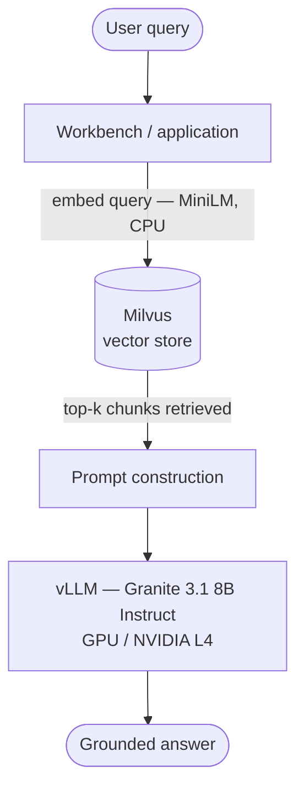

# 01 — Sovereign RAG on RHOAI

## What this demonstrates
A fully air-gapped retrieval-augmented generation pipeline running on
Red Hat OpenShift AI. A user queries regulatory documents in plain language;
the system retrieves relevant chunks from Milvus and generates a grounded
answer using a locally-served Granite model via vLLM.

No data leaves the cluster. No external API calls.

## Architecture



## Prerequisites
- RHOAI 2.x or 3.x cluster with GPU node
- S3-compatible object store (or PVC) with model pre-staged
- `oc` CLI authenticated to the cluster

## Deploy

```bash
# 1. Set credentials (never commit these)
export AWS_ACCESS_KEY_ID=xxx
export AWS_SECRET_ACCESS_KEY=yyy
export AWS_DEFAULT_REGION=us-east-1
export AWS_S3_BUCKET=your-bucket
export AWS_S3_ENDPOINT=https://s3.amazonaws.com

# 2. Apply all manifests in order
envsubst < manifests/06-data-connection.yaml | oc apply -f -
oc apply -f manifests/00-namespace.yaml
oc apply -f manifests/01-datascienceproject.yaml
oc apply -f manifests/02-milvus.yaml
oc apply -f manifests/03-model-serving-runtime.yaml
oc apply -f manifests/04-inference-service.yaml
oc apply -f manifests/05-workbench.yaml

# 3. Wait for model to load (typically 3–5 min depending on GPU)
oc get inferenceservice -n sovereign-rag -w

# 4. Open the workbench from the RHOAI dashboard
# Run notebooks in order: 01 → 02
```

## Teardown

```bash
oc delete namespace sovereign-rag
```
All resources are namespace-scoped. One command cleans everything.

## Known variables to resolve in the live environment
- [ ] GPU type → adjust `--max-model-len` and model variant in 04-inference-service.yaml
- [ ] Confirm vLLM image tag is current for your RHOAI version
- [ ] Confirm Notebook image tag is current
- [ ] Update storageUri with actual bucket/path

## Demo narrative
_To be developed. See top-level README for status._
